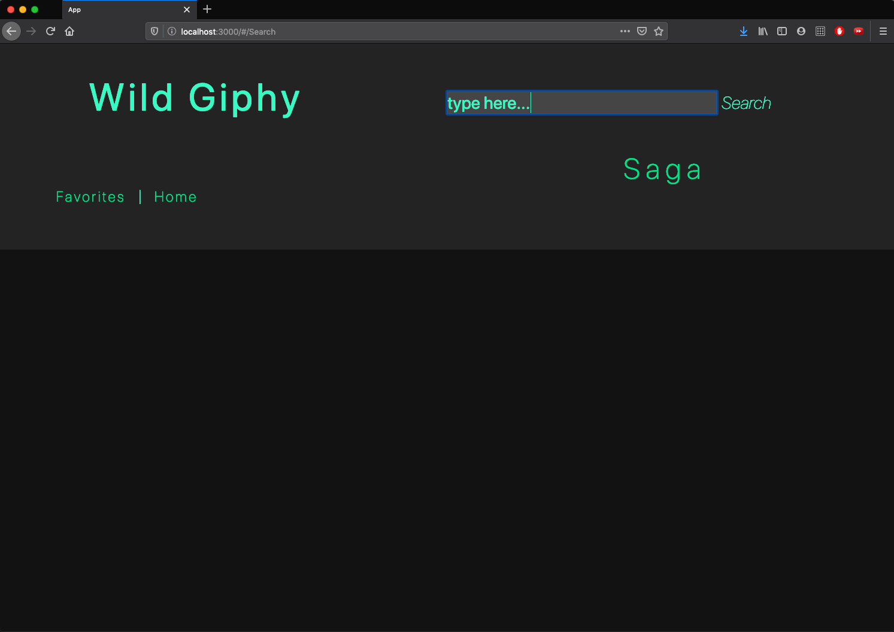
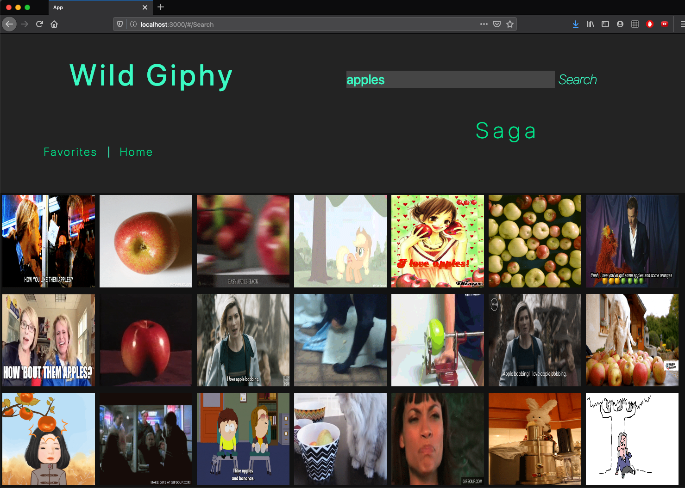

# Giphy Saga Group Project

### Built By:
Mase Santos, Eric Elvendahl, Nick Simonelli

## Description

>Duration, 24-hour Group Effort

This one day project was focused on utilizing Saga and api requests to create a more versatile and dynamic end product. The primary task of this project included providing the user with a search page where they would be able to browse for gifs. When desired one could favorite and image to which they would later be able to view and categorize.

With more time we would like to continue to add feedback visuals around buttons and inputs to provide the user with more natural response when interacting with our application. We would also like to provide users the option to name multiple categories per favorite image should they desire.

## Screen Shots

## Installation

1. Set-up 'giphy_search_favorites' DB using the provided sql file
2. Currently you will need to provide your own Giphy API key by creating a dotenv file after cloning this repo. This can be done via [GIPHY Developers](https://developers.giphy.com/)
3. npm intall  
4. npm run server, npm run client

## Usage

1. Navigate to the search page and begin to browse for gifs.
2. Favorite gifs as desired.
3. Navigate to the favorites page to view and categorize your collection.
4. Repeat as often as you like!

## Technologies Used

- [React.js](https://reactjs.org/)
- [Redux.js](https://redux.js.org/)
- [Saga](https://redux-saga.js.org/)
- [Axios](https://www.npmjs.com/package/axios)
- [Node.js](https://nodejs.org/en/) 
- [Express.js](https://expressjs.com/)
- [PostgreSQL/Postico](https://www.postgresql.org/)

## Acknowledgement
Thank you to our instructors [Mary](https://github.com/mbMosman) and [Dev](https://github.com/devjanaprime) as well as our amazing fellow Paxos cohort members at [Prime Digital Academy](www.primeacademy.io)! This work is only possible with the generous amount of knowledge, support, and encouragement that they provide to each of us.